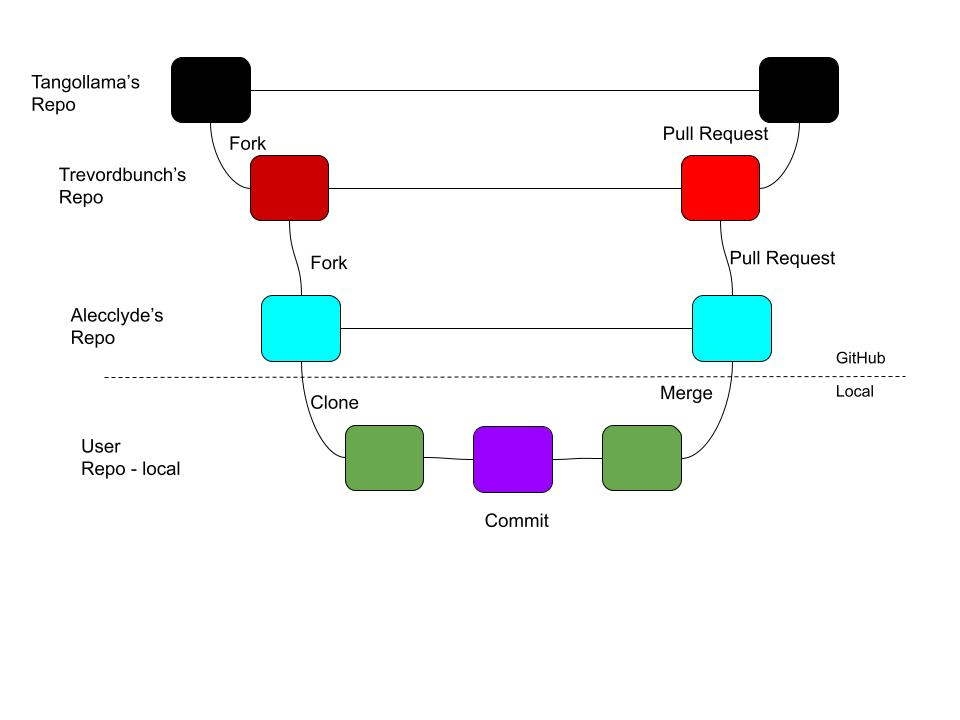
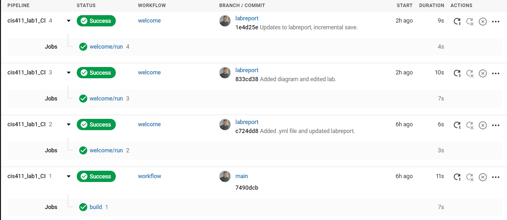

# Lab Report: Continuous Integration
___
**Course:** CIS 411, Spring 2021  
**Instructor(s):** [Trevor Bunch](https://github.com/trevordbunch)  
**Name:** Alec Chappell  
**GitHub Handle:** @alecclyde  
**Repository:** [Alecclyde's Forked Repository](https://github.com/alecclyde/cis411_lab1_CI)  
___

# Step 1: Fork this repository
- The URL of my forked repository: [URL HERE](https://github.com/alecclyde/cis411_lab1_CI)
  
- The accompanying diagram of what my fork precisely and conceptually represents... 

# Step 2: Clone your forked repository from the command line  
- My local file directory is... C:\Users\alecc\Documents\GitHub\cis411_lab0_req
  
- The command to navigate to the directory when I open up the command line is... **"cd >folder<"**

# Step 3: Run the application locally
- My GraphQL response from adding myself as an account on the test project:
``` json
{
  "data": {
    "mutateAccount": {
      "id": "0b0ad924-e74e-4f46-84e1-66ebfa7e9d50",
      "name": "Alec Chappell",
      "email": "ac1474@messiah.edu"
    }
  }
}
```

# Step 4: Creating a feature branch
- The output of my git commit log:
```
2d0d321 (HEAD -> labreport, origin/labreport) Added a feature branch.
f6aebbd (origin/purelab, purelab) Updated package-lock.json
f8513e0 (upstream/purelab) Update Node links to Instructions
d4f22eb Update repo branch names
0e3ae4c Reset purelab
050b420 Merge pull request #2 from trevordbunch/main
1fe415c Merge pull request #1 from trevordbunch/labreport
13e571f Update Lab readme, instructions and templates
eafe253 Adjust submitting instructions
47e83cd Add images to LabReport
ec18770 Add Images
dbf826a Answer Step 4
a9c1de6 Complete Step 1, 2 and 3 of LAB_TREVORDBUNCH
1ead543 remove LAB.md
8c38613 Initial commit of labreport with @tangollama
dabceca Merge pull request #24 from tangollama/circleci
a4096db Create README.md
2f01bf4 Update LAB_INSTRUCTIONS.md
347bd50 Update LAB_INSTRUCTIONS.md
7aaa9f3 Update LAB_INSTRUCTIONS.md
37393ae Bug fixed
1949d2a Update LAB_INSTRUCTIONS.md
d36ad90 Update LAB.md
59ef18a Update LAB_INSTRUCTIONS.md
37be3c8 Update LAB_INSTRUCTIONS.md
97da547 Update LAB.md
0bd6244 updated Step 0 title
4562cd8 added npm and node install repreq
255051e adding template
13a09b7 Adding the LAB.md and correcting some instructions.
d2ddea5 Version 0.0.1 of the lab instructions
ab312fc more progress
62fb0a5 more progress
fe1937b more in the lab instructions
3e807fb first section
9ae6b83 remove LAB.md
e429c1a lab instructions
ce1fcea circleci default config
80bbdbb circleci default config
968099e remove test db
7362cd1 working
44ce6ae Initial commit
``` 
- The accompanying diagram of what my feature branch precisely and conceptually represents:  
  

# Step 5: Setup a Continuous Integration configuration
- What is the .circleci/config.yml doing?
  - This file tells CircleCI how to configure their processes to work with the project. The file can also store network preferences that allow the connection to happen because both programs are on the same page when it comes to settings. An .yml file is in a language that is easy to translate to other languages.

- What do the various sections on the config file do?
  - **Orbs**: Are packages of configuration code that people share to make creating a config file easier.
  - **Workflows**: Using rules, keep jobs in their run order. This keeps everyone up to date on progress.
  - **Jobs**: A collection of different processes that are ran together as a unit. 
  
- When a CI build is successful, what does that philosophically and practically/precisely indicate about the build?  
  - That mean that the code passed the automated debugging process. The code will be tested just to make sure it functions with predefined tests. This also makes sure that the code will actually deploy and run. If the code still functions but does not do what it was intended, it will still be a "successful" build.

- If you were to take the next step and ready this project for Continuous Delivery, what additional changes might you make in this configuration (conceptual, not code)?
  - I would make sure that everyone that was working on the project knew how the code functioned, to keep errors minimal. I would want a beta stream and a stable stream to catch bugs before they go public. I also would also want to automate everything that I can.
   

# Step 6: Merging the feature branch
The output of my git commit log:

```
Trevors-MBP:cis411_lab0 trevorbunch$ git log --oneline
dbf826a (HEAD -> labreport, origin/labreport) Answer Step 4
a9c1de6 Complete Step 1, 2 and 3 of LAB_TREVORDBUNCH
1ead543 remove LAB.md
8c38613 Initial commit of labreport with @tangollama
dabceca (upstream/main, origin/main, origin/HEAD, main) Merge pull request #24 from tangollama/circleci
a4096db Create README.md
...
44ce6ae Initial commit
(END)
```

* A screenshot of the _Jobs_ list in CircleCI:


# Step 7: Submitting a Pull Request
Artur's GitHub:  
Joe T's GitHub:


# Step 8: [EXTRA CREDIT] Augment the core project
PR reference in the report to one of the following:
1. Add one or more unit tests to the core assignment project. 
2. Configure the CircleCI config.yml to automatically build a Docker image of the project.
3. Configure an automatic deployment of the successful CircleCI build to an Amazon EC2 instance.
